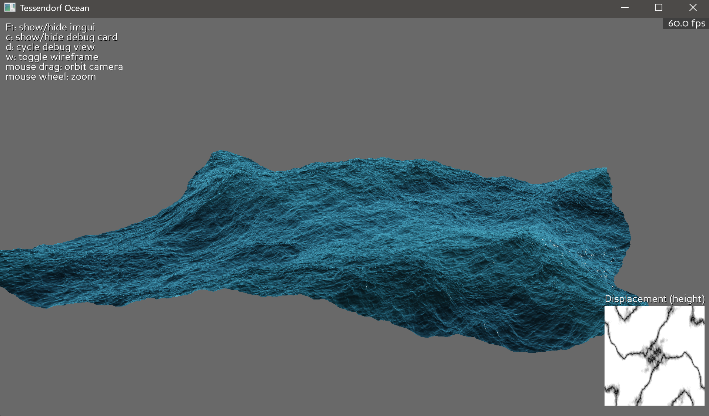

# p3d_ocean

GPU ocean simulation and rendering in Panda3D using compute shaders and a Tessendorf-style spectrum.

Inspired by https://github.com/achalpandeyy/OceanFFT — thanks, dude.

## Features
- FFT-based ocean spectrum simulation
- GPU compute pipeline for spectrum, IFFT, displacement and slope/normal maps
- Orbit camera controls and debug texture cards
- ImGui live tuning for simulation and rendering parameters
- Basic shading



## Requirements
- Python 3.10+ (recommended)
- GPU with OpenGL 4.3+ (required for compute shaders)

## Setup
1. Create and activate a virtual environment (optional but recommended).

   Windows (PowerShell):
   ```powershell
   python -m venv .venv
   .\.venv\Scripts\Activate.ps1
   ```

   Linux:
   ```bash
   python -m venv .venv
   source .venv/bin/activate
   ```

2. Install dependencies:
   ```powershell
   pip install -r requirements.txt
   ```

## Run
From the repository root:
```powershell
python -m src.main
```

## Controls
- Mouse drag: orbit camera
- Mouse wheel: zoom
- W: toggle wireframe
- C: show/hide debug card
- D: cycle debug view
- F1: toggle ImGui overlay
